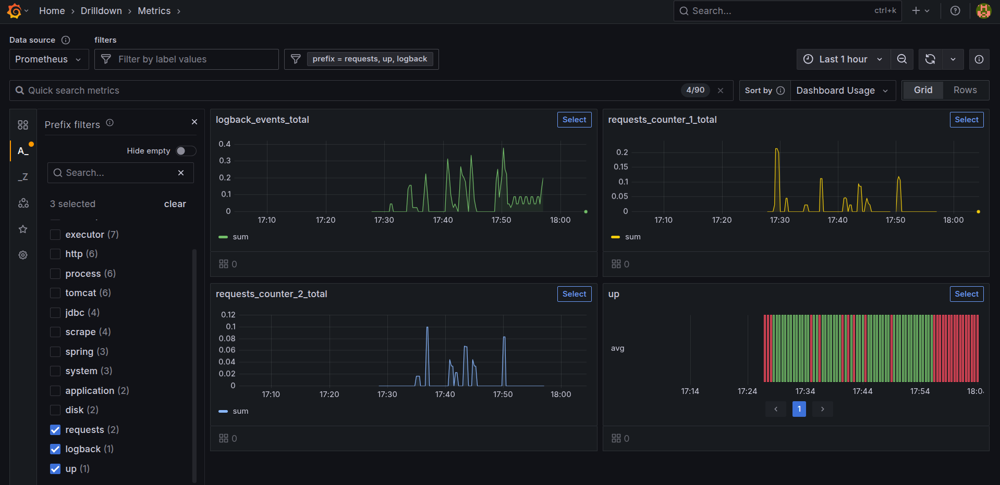
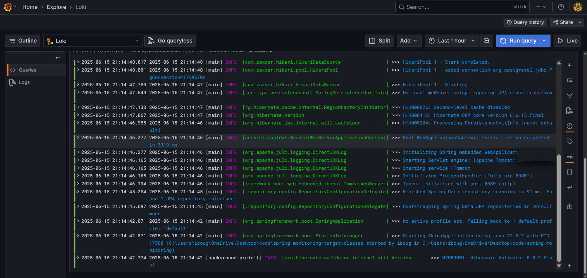
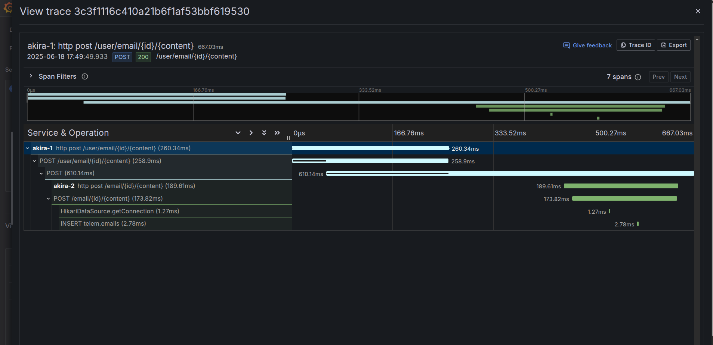

# Distributed Observability
Observability is the ability to measure the internal state of a system only by its external outputs.
For a distributed system like microservices, these external outputs are basically known as telemetry data. It includes information like the resource consumption of a machine, the logs generated by the applications running on a machine, and several others.
In this project I'm using [Grafana](https://grafana.com/), [Loki](https://grafana.com/oss/loki/), [Prometheus](https://prometheus.io/), [Zipkin](https://zipkin.io/) and [Spring boot](https://spring.io/projects/spring-boot)


The whole Collection and visualization layer is put together through [Docker compose](https://docs.docker.com/compose/), and can be ran with a simple command
```bash
docker compose up
```
Then the Grafana interface will be accessible from `http://localhost:3000/`. For the services, each one should be run individually, by first entering the `services` directory and running the PostgreSQL docker container using the `docker compose up` command. Then, for each of the two services, we just enter the directory of the service and run the command
```bash
./mvnw spring-boot:run
```

# The project so far
Note that I still can't access the Zipkin data from Grafana. And that I only have one service so far in the project

## The metrics
The metrics data is collected into a Prometheus database, then read by Grafana, where we can create dashboards from it



## The logs
For the logs we're using Grafana Loki, we collect them in a Loki instance, then visualize them using Grafana



## The traces
We're using Tempo as a traces collector


